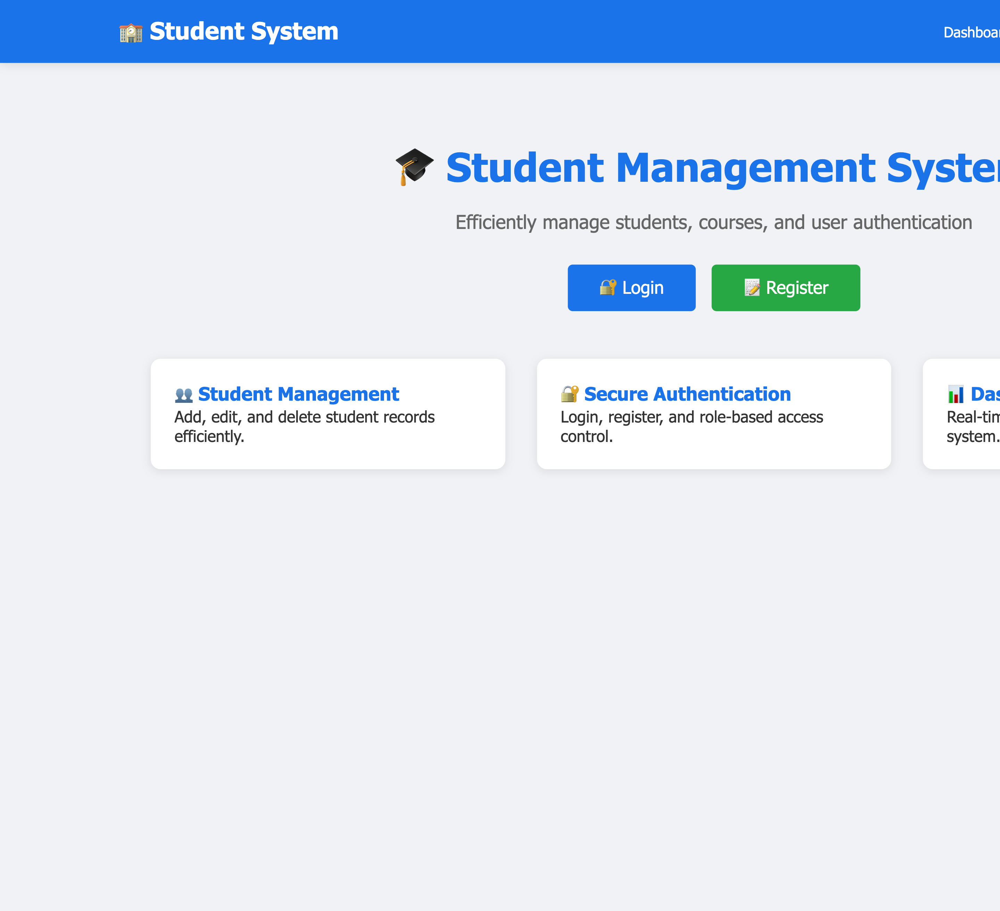
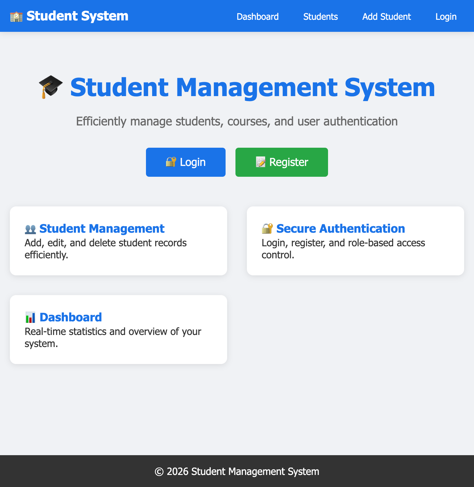
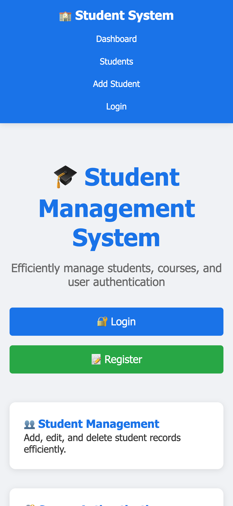

# 🎓 Student Management System

A complete web-based student management system built with PHP, MySQL, HTML, CSS, and JavaScript.

---

## 📋 Project Overview

The **Student Management System** is a fully functional web application that allows educational institutions to efficiently manage student records, courses, and user authentication. This project demonstrates full-stack web development skills including database design, user authentication, CRUD operations, and responsive design.

### Key Features

| Feature | Description |
|---------|-------------|
| **User Authentication** | Registration, Login, Logout with password hashing |
| **Role-Based Access** | Admin, Lecturer, Student roles with different permissions |
| **Student Management** | Add, View, Edit, Delete student records |
| **Dashboard** | Statistics, recent students, quick actions |
| **Search** | Find students by name or ID |
| **Responsive Design** | Works on desktop, tablet, and mobile devices |
| **Secure** | Password hashing, prepared statements, input sanitization |

---

## 🛠️ Technologies Used

| Technology | Purpose |
|------------|---------|
| **PHP 7.4+** | Backend logic and server-side processing |
| **MySQL 5.7+** | Database for storing student and user data |
| **HTML5** | Page structure |
| **CSS3** | Styling and responsive design |
| **JavaScript** | Form validation and interactivity |
| **XAMPP** | Local development environment |
| **Git & GitHub** | Version control |

---

## 🚀 Quick Setup

### 1. Prerequisites
- XAMPP (or MAMP/WAMP) installed
- PHP 7.4+ and MySQL 5.7+

### 2. Installation Steps

**Clone the repository:**
```bash
git clone https://github.com/Martin254-gif/BIT3208_Project.git
```

**Move to XAMPP htdocs:**
```bash
# Mac
cp -r BIT3208_Project /Applications/XAMPP/xamppfiles/htdocs/

# Windows
copy BIT3208_Project C:\xampp\htdocs\
```

**Start XAMPP:**
- Open XAMPP Control Panel
- Start **Apache** and **MySQL**

**Create Database:**
1. Open `http://localhost/phpmyadmin`
2. Create database: `student_system`
3. Import `week7/database/schema.sql`

**Configure Database:**
Edit `week7/includes/db-connect.php`:
```php
$host = 'localhost';
$username = 'root';
$password = '';
$database = 'student_system';
```

**Access the Application:**
```
http://localhost/student-management-system/week7/pages/index.php
```

---

## 🔐 Default Login Credentials

| Role | Email | Password |
|------|-------|----------|
| **Administrator** | admin@example.com | password123 |
| **Lecturer** | lecturer@example.com | password123 |
| **Student** | student@example.com | password123 |

> ⚠️ These are demo accounts. Change passwords in production.

---

## 📁 Project Structure

```
student-management-system/
│
├── week1/          # Environment Setup
│   ├── index.php         # Hello World
│   ├── db-test.php       # Database connection test
│   └── screenshots/
│
├── week2/          # Wireframes & UI Design
│   ├── wireframes/       # Login, Dashboard, Mobile mockups
│   ├── project-proposal-summary.md
│   └── folder-structure-planning.md
│
├── week3/          # Frontend & Backend Foundations
│   ├── js/               # Form validation, Password strength
│   ├── php/              # PHP syntax practice
│   └── db/               # Database connection
│
├── week4/          # Dynamic Backend Processing
│   ├── pages/            # Login, Register, Dashboard, Contact
│   └── includes/         # Header, Footer, Functions
│
├── week5/          # Database & CRUD Operations
│   ├── pages/            # Add, Edit, Delete, View students
│   └── includes/         # Reusable PHP components
│
├── week6/          # Database Integration
│   ├── pages/            # Enhanced CRUD with search
│   └── includes/         # Functions and helpers
│
├── week7/          # User Authentication & Sessions
│   ├── pages/            # Login, Register, Dashboard, Profile
│   └── includes/         # Auth middleware, Functions
│
├── week8/          # Responsive Web Design
│   ├── task1-profile/    # Personal Profile Page
│   ├── task2-products/   # Product Showcase
│   └── school-system/    # Responsive School System
│
├── README.md       # This file
└── .gitignore      # Git ignore file
```

---

## 🗄️ Database Schema

### users Table
| Column | Type | Description |
|--------|------|-------------|
| id | INT | Primary Key |
| fullname | VARCHAR(100) | User's full name |
| email | VARCHAR(100) | Unique email |
| password_hash | VARCHAR(255) | Hashed password |
| role | ENUM | admin, lecturer, student |
| created_at | TIMESTAMP | Registration date |

### students Table
| Column | Type | Description |
|--------|------|-------------|
| id | INT | Primary Key |
| student_id | VARCHAR(20) | Auto-generated unique ID |
| fullname | VARCHAR(100) | Student's full name |
| email | VARCHAR(100) | Unique email |
| phone | VARCHAR(20) | Contact number |
| course | VARCHAR(100) | Enrolled course |
| created_at | TIMESTAMP | Enrollment date |

### courses Table
| Column | Type | Description |
|--------|------|-------------|
| id | INT | Primary Key |
| course_code | VARCHAR(20) | Unique course code |
| course_name | VARCHAR(100) | Course name |
| description | TEXT | Course description |
| credits | INT | Credit hours |

---

## 📸 Screenshots

### Desktop Dashboard


### Tablet Dashboard


### Mobile Dashboard


---

## 🔒 Security Features

| Security Measure | Implementation |
|------------------|----------------|
| **Password Hashing** | `password_hash()` with bcrypt |
| **SQL Injection Prevention** | Prepared statements |
| **Input Sanitization** | `htmlspecialchars()`, `trim()` |
| **Session Security** | Session-based authentication |
| **Access Control** | Role-based permissions |
| **Protected Pages** | Authentication middleware |

---

## 📱 Responsive Design

The system uses a **Mobile-First** approach with:

- **Flexbox** for flexible layouts
- **CSS Grid** for product and card layouts  
- **Media Queries** for different screen sizes
- **Responsive Tables** that convert to cards on mobile
- **Hamburger Menu** on mobile devices

### Breakpoints

| Device | Screen Width |
|--------|--------------|
| Mobile | 0–767px |
| Tablet | 768–1023px |
| Laptop | 1024–1439px |
| Desktop | 1440px+ |

---

## 🎯 Key Features Explained

### User Authentication Flow
1. User registers with fullname, email, and password
2. Password is hashed using bcrypt before storage
3. User logs in with email and password
4. Password is verified using `password_verify()`
5. Session is created on successful login
6. User is redirected to dashboard

### CRUD Operations
- **Create:** Add new student with auto-generated Student ID
- **Read:** View all students in sortable table with search
- **Update:** Edit student details with pre-filled form
- **Delete:** Remove student with confirmation prompt

### Dashboard
- Statistics cards (Total Students, Courses, New Registrations)
- Recent students list
- Quick action buttons
- Role-specific content

---

## 👨‍💻 Author

**Martin Mwangi**

- **GitHub:** [@Martin254-gif](https://github.com/Martin254-gif)
- **Project:** [BIT3208_Project](https://github.com/Martin254-gif/BIT3208_Project)

---

## 📄 License

This project is licensed under the MIT License.

```
MIT License

Copyright (c) 2026 Martin Mwangi

Permission is hereby granted, free of charge, to any person obtaining a copy
of this software and associated documentation files (the "Software"), to deal
in the Software without restriction, including without limitation the rights
to use, copy, modify, merge, publish, distribute, sublicense, and/or sell
copies of the Software, and to permit persons to whom the Software is
furnished to do so, subject to the following conditions:

The above copyright notice and this permission notice shall be included in all
copies or substantial portions of the Software.

THE SOFTWARE IS PROVIDED "AS IS", WITHOUT WARRANTY OF ANY KIND, EXPRESS OR
IMPLIED, INCLUDING BUT NOT LIMITED TO THE WARRANTIES OF MERCHANTABILITY,
FITNESS FOR A PARTICULAR PURPOSE AND NONINFRINGEMENT. IN NO EVENT SHALL THE
AUTHORS OR COPYRIGHT HOLDERS BE LIABLE FOR ANY CLAIM, DAMAGES OR OTHER
LIABILITY, WHETHER IN AN ACTION OF CONTRACT, TORT OR OTHERWISE, ARISING FROM,
OUT OF OR IN CONNECTION WITH THE SOFTWARE OR THE USE OR OTHER DEALINGS IN THE
SOFTWARE.
```

---

## 🙏 Acknowledgments

- **Course Instructors** - For providing the course structure
- **XAMPP Team** - For the excellent local development environment
- **PHP & MySQL Communities** - For comprehensive documentation
- **GitHub** - For free hosting and version control

---

## 📞 Support

For questions or feedback:
- **GitHub Issues:** [Open an Issue](https://github.com/Martin254-gif/BIT3208_Project/issues)
- **GitHub:** [@Martin254-gif](https://github.com/Martin254-gif)

---

**🎓 Built with ❤️ for the BIT3208 Course**

**© 2026 Martin Mwangi | All Rights Reserved**